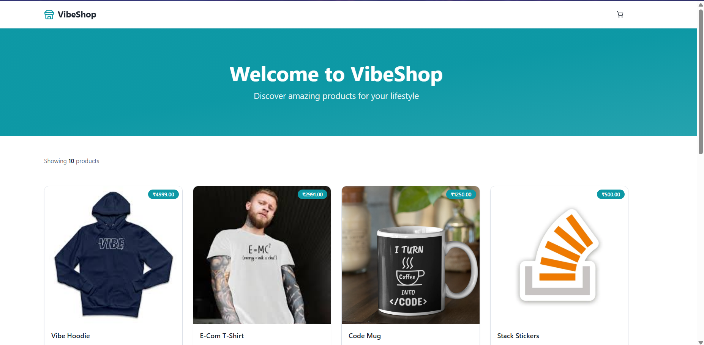
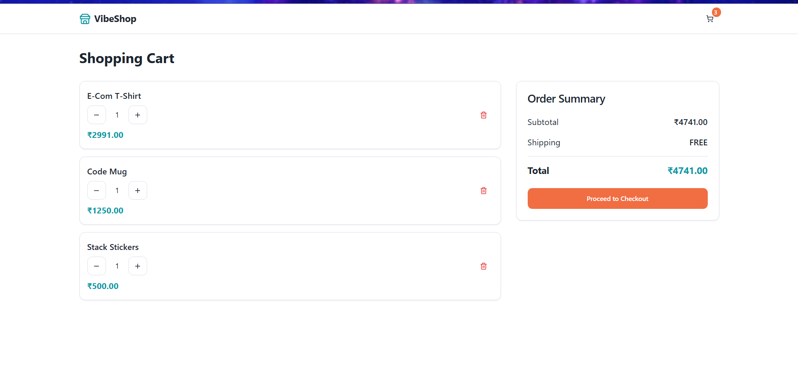
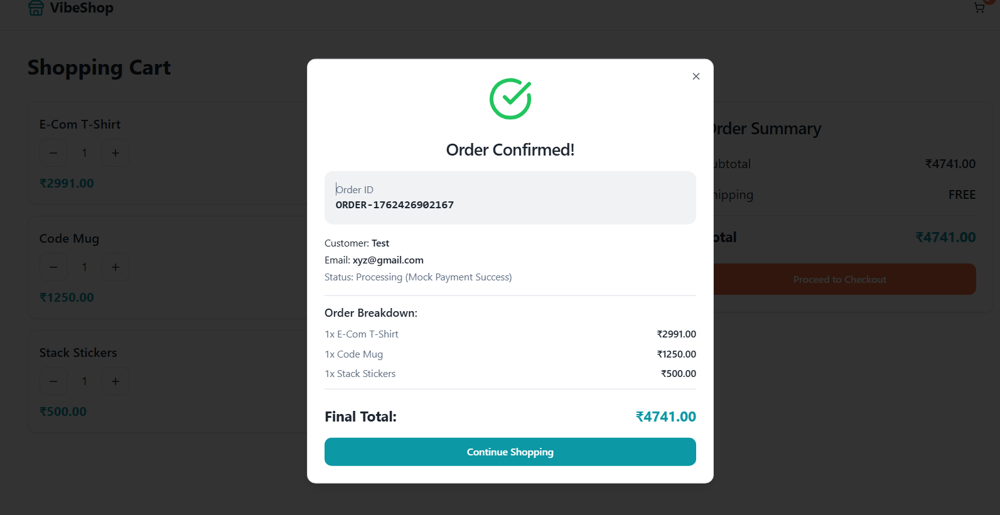

# Vibe Commerce Mock Shopping Cart

## Technologies Used

| Stack Component | Technology                        | Description                                                                                                 |
| :-------------- | :-------------------------------- | :---------------------------------------------------------------------------------------------------------- |
| **Frontend**    | **React**  & **TypeScript** | Component-based UI. State managed via **React Context** (`CartContext`). Uses **shadcn/ui** for components. |
| **Backend**     | **Node.js** & **Express**         | REST API server, structured with separate **Routes** and **Controllers**.                                   |
| **Database**    | **MongoDBAtlas** (via Mongoose)        | Persistent storage for `Products` and the mock user's `Cart`.                                               |
| **Styling**     | **Tailwind CSS**                  | Utility-first CSS framework for rapid responsive design.                                                    |

---

## Project Setup and Installation

Follow these steps to get the application running locally.

### 1. Prerequisites

* Node.js (v18+)
* MongoDB Instance (Local or Atlas URI)

### 2. Backend Setup (`/backend`)

The backend requires environment variables to connect to the database.

1. Navigate to the backend directory:

   ```bash
   cd backend
   ```
2. Install dependencies:

   ```bash
   npm install
   ```
3. Create a file named **`.env`** in the `backend` folder and add your configuration:

   ```dotenv
   # .env in the backend folder
   PORT=5000
   DB_URI=mongodb+srv://[YOUR_USER]:[YOUR_PASSWORD]@[YOUR_CLUSTER]/vibe_cart_db?retryWrites=true&w=majority

   # Secure key for initial product seeding
   ADMIN_API_KEY=vibe_secret_admin_key
   ```
4. Start the backend server:

   ```bash
   npm start # or node server.js
   ```

   The server should confirm **"MongoDB connected"** and **"Server running on port 5000"**.

### 3. Initial Product Seeding (Optional)

To populate the database with initial products, use a tool like Postman or VS Code Thunder Client to hit the protected admin route:

* **Method:** `POST`
* **URL:** `http://localhost:5000/api/admin/products/import`
* **Header:** `x-api-key: vibe_secret_admin_key`
* **Body (JSON):** Provide an array of products:

  ```json
  [
    { "id": 1, "name": "Vibe Hoodie", "price": 49.99, "image_url": "..." },
    { "id": 2, "name": "E-Com T-Shirt", "price": 29.99, "image_url": "..." }
  ]
  ```

### 4. Frontend Setup (`/frontend`)

1. Navigate to the frontend directory:

   ```bash
   cd ../frontend
   ```
2. Install dependencies:

   ```bash
   npm install
   ```
3. Start the React development server:

   ```bash
   npm run dev
   ```

   The frontend should open automatically (usually on `http://localhost:8080`).

---

## Key Design and Implementation Details

### 1. Backend Architecture (Express/Node)

* **Structure:** Follows the MVC-like pattern with separate **`routes/`** (API mapping), **`controllers/`** (business logic/DB operations), and **`middleware/`** (authentication).
* **Admin Route Security:** The `POST /api/admin/products/import` route is protected by the `adminAuth` middleware using the `x-api-key` header, demonstrating secure administrative access control.
* **Database Efficiency:** Uses **`Product.bulkWrite`** with `upsert: true` for product import, ensuring efficient initial seeding and subsequent updates without duplicating records.

### 2. Frontend State Management (React)

* **`CartContext.jsx`:** Centralized state management for the entire cart, providing global access to the cart state, loading status, and core manipulation functions (`addItem`, `removeFromCart`, `checkout`).
* **Decoupled Checkout Flow:** The `checkout` function in the context **returns the receipt** and **then clears the global cart state**. This two-step process prevents a **race condition** where the cart is emptied (unmounting the modal) before the receipt can be displayed.
* **UI Components:** Utilizes **shadcn/ui** components for accessibility and a clean, modern aesthetic.

### 3. API Contract Summary

The application implements the required REST API endpoints for a public-facing cart service:

| Method     | Endpoint        | Purpose                      |
| :--------- | :-------------- | :--------------------------- |
| **GET**    | `/api/products` | Fetch product list.          |
| **GET**    | `/api/cart`     | Get current cart state.      |
| **POST**   | `/api/cart`     | Add/update item quantity.    |
| **PUT**    | `/api/cart/:id` | Update quantity for an item. |
| **DELETE** | `/api/cart/:id` | Remove item by ID.           |
| **POST**   | `/api/checkout` | Mock payment and clear cart. |
  

---

##  Screenshots

| Screen               | Image |
| :------------------- | :---- |
| **Product Listing**  |  |
| **Cart View**        |        |
| **Checkout Receipt** |       |

---

